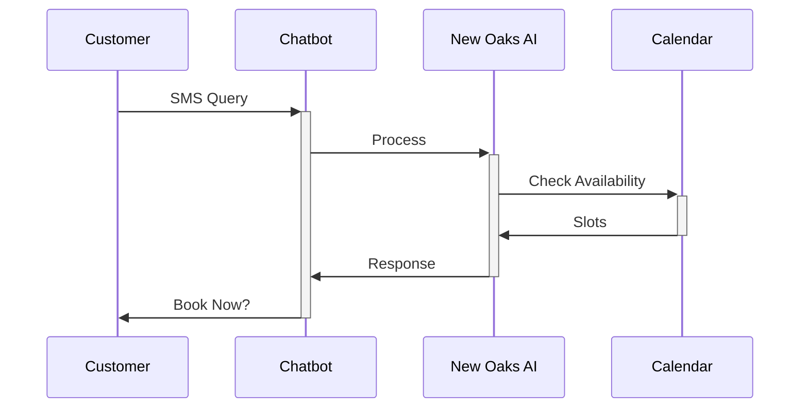

## Overview

Configure your New Oaks AI chatbot to match your business voice, handle appointment bookings efficiently, and optimize SMS interactions. Access the configuration dashboard from your account settings to customize greetings, response styles, and integration rules. These settings ensure seamless customer engagement while aligning with your brand, such as using your business color `#a8a9a9` for themed responses.

<Columns cols={3}>
  <Card title="Personalization" icon="user" href="#personalization">
    Customize greetings and tone.
  </Card>
  <Card title="Booking Rules" icon="calendar" href="#booking">
    Define availability and confirmations.
  </Card>
  <Card title="SMS Setup" icon="message-circle" href="#sms">
    Integrate with your phone provider.
  </Card>
</Columns>

## Personalization Settings

Personalize your chatbot to reflect your brand's personality. Set custom greetings, response tones, and fallback messages.

<Steps>
  <Step title="Access Settings" icon="settings">
    Navigate to **Dashboard > Configuration > Personalization**.
  </Step>
  <Step title="Update Greeting" icon="edit">
    Enter your welcome message, like "Hi! Welcome to Rayluan Salon. Ready to book?".
  </Step>
  <Step title="Set Tone" icon="message-circle">
    Choose from options: friendly, professional, or casual.
  </Step>
  <Step title="Save Changes" icon="save">
    Test in the preview pane before deploying.
  </Step>
</Steps>

<Callout kind="tip">
  Use variables like `{customer_name}` in greetings for a personal touch. Preview responses to ensure they align with your brand.
</Callout>

<Tabs>
  <Tab title="JSON Config" icon="code">
    Update your config file with these settings:

    <CodeGroup tabs="JSON,YAML">
```json
{
  "greeting": "Hi {customer_name}! How can I help with your appointment?",
  "tone": "friendly",
  "brandColor": "#a8a9a9",
  "fallback": "Sorry, I didn't get that. Try asking about services or booking."
}
```
```yaml
greeting: "Hi {customer_name}! How can I help with your appointment?"
tone: friendly
brandColor: "#a8a9a9"
fallback: "Sorry, I didn't get that. Try asking about services or booking."
```
    </CodeGroup>
  </Tab>
  <Tab title="UI Editor" icon="edit-3">
    Use the drag-and-drop editor to build response flows visually.
  </Tab>
</Tabs>

## Appointment Booking Rules

Define rules for when and how the chatbot books appointments. Set availability windows, service durations, and confirmation flows.

<Expandable title="Advanced Booking Rules" default-open="false">

Configure rules via the API or dashboard:

```javascript
// Example API call to update rules
const rules = {
  services: ["haircut", "coloring"],
  duration: 30, // minutes
  buffer: 15, // minutes between bookings
  maxDaily: 20
};

fetch('/api/config/booking', {
  method: 'POST',
  headers: { 'Authorization': 'Bearer YOUR_TOKEN' },
  body: JSON.stringify(rules)
});
```

</Expandable>

| Rule Type       | Description                          | Default Value |
|-----------------|--------------------------------------|---------------|
| Service List    | Available services                   | []            |
| Slot Duration   | Time per appointment (minutes)       | 30            |
| Daily Limit     | Maximum bookings per day             | 50            |
| Confirmation    | SMS confirmation required            | true          |

## SMS Channel Configuration

Set up SMS for 24/7 conversations. Integrate with providers like Twilio or your carrier.

<Callout kind="alert">
  Ensure your phone number supports inbound SMS. Test with a sample message before going live.
</Callout>



<Steps>
  <Step title="Add Provider" icon="plus">
    Select Twilio or custom carrier in **SMS > Providers**.
  </Step>
  <Step title="Enter Credentials" icon="key">
    Provide SID, auth token (use `YOUR_SID`, `YOUR_AUTH_TOKEN`), and phone number like `+15551234567`.
  </Step>
  <Step title="Verify Webhook" icon="check-circle">
    Set webhook URL to `https://api.newoaks.ai/webhook/sms`.
  </Step>
  <Step title="Test Channel" icon="smartphone">
    Send a test SMS to confirm two-way messaging.
  </Step>
</Steps>

These configurations enable your chatbot to convert queries into booked appointments effortlessly, providing a personalized experience powered by ChatGPT. Monitor performance in the analytics dashboard to refine settings over time.