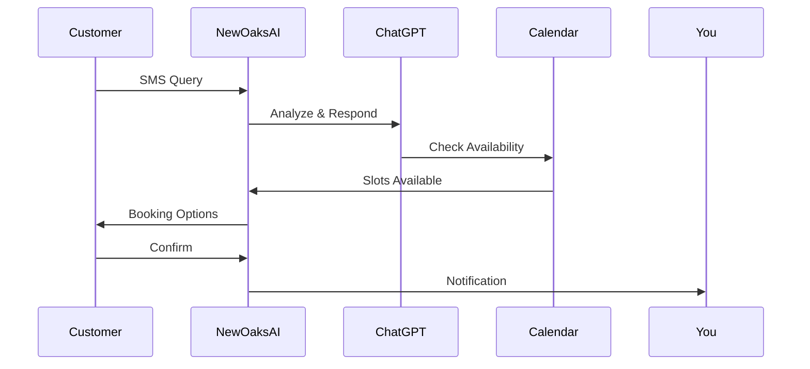

## Overview

New Oaks AI empowers small to medium-sized businesses with intelligent, ChatGPT-powered chatbots that handle customer interactions via SMS. You gain 24/7 availability to engage customers, answer queries, and convert conversations into booked appointments seamlessly. This AI solution personalizes experiences, reduces manual work, and boosts revenue without complex setups.

<Columns cols={3}>
  <Card title="24/7 SMS Conversations" icon="message-circle" href="/docs/sms-setup">
    Respond instantly to customer texts around the clock, ensuring no query goes unanswered.
  </Card>
  <Card title="Appointment Booking" icon="calendar" href="/docs/booking">
    Automate scheduling by guiding customers through availability and confirmations.
  </Card>
  <Card title="Personalized Engagement" icon="heart" href="/docs/personalization">
    Tailor responses based on customer history for higher satisfaction and loyalty.
  </Card>
</Columns>

## Key Benefits for SMBs

You benefit from New Oaks AI in multiple ways, tailored to your business needs. Explore these advantages across common SMB scenarios.

<Tabs>
  <Tab title="Retail" icon="shopping-bag">
    Handle inquiries about products, hours, and promotions via SMS. Convert browsers into buyers with instant responses.
  </Tab>
  <Tab title="Services" icon="wrench">
    Streamline bookings for salons, clinics, or repairs. You reduce no-shows with automated reminders.
  </Tab>
  <Tab title="E-commerce" icon="package">
    Provide order tracking and support post-purchase. You increase repeat sales through proactive engagement.
  </Tab>
</Tabs>

<Callout kind="success">
  Businesses using New Oaks AI report up to 40% more appointments booked automatically.
</Callout>

## How the AI Solution Works

New Oaks AI integrates ChatGPT with your SMS provider to create natural conversations. Follow these steps to understand the process.

<Steps>
  <Step title="Customer Sends SMS" icon="smartphone">
    A customer texts your business number with a query like "Book a haircut tomorrow."
  </Step>
  <Step title="AI Processes Request" icon="brain">
    ChatGPT analyzes the message, checks your calendar, and generates a personalized response.
  </Step>
  <Step title="Appointment Confirmed" icon="check-circle">
    The customer confirms via SMS, and you receive a notification with details synced to your calendar.
  </Step>
</Steps>



## Quick Integration Example

Integrate New Oaks AI into your workflow using simple API calls. Start by setting up webhooks for incoming SMS.

<CodeGroup tabs="Node.js,Python">
  ```javascript
  const axios = require('axios');

  // Webhook handler for incoming SMS
  app.post('/sms-webhook', async (req, res) => {
    const { message, phone } = req.body;
    const response = await axios.post('https://api.newoaks.ai/chat', {
      message,
      phone,
      apiKey: 'YOUR_API_KEY'
    });
    // Send response back via SMS provider
    res.json({ reply: response.data.reply });
  });
  ```
  ```python
  import requests
  from flask import Flask, request, jsonify

  app = Flask(__name__)

  @app.route('/sms-webhook', methods=['POST'])
  def sms_webhook():
      data = request.json
      message = data['message']
      phone = data['phone']
      response = requests.post('https://api.newoaks.ai/chat', json={
          'message': message,
          'phone': phone,
          'api_key': 'YOUR_API_KEY'
      })
      return jsonify({'reply': response.json()['reply']})
  ```
</CodeGroup>

<Expandable title="Frequently Asked Questions" default-open="false">
  ### What SMS providers work with New Oaks AI?
  You integrate with Twilio, MessageBird, or any provider supporting webhooks.

  ### Is setup technical?
  Basic setup takes under 10 minutes with our dashboard. Advanced customizations use the API.
</Expandable>

Ready to enhance your customer engagement? [Sign up](/signup) and deploy your first chatbot today.