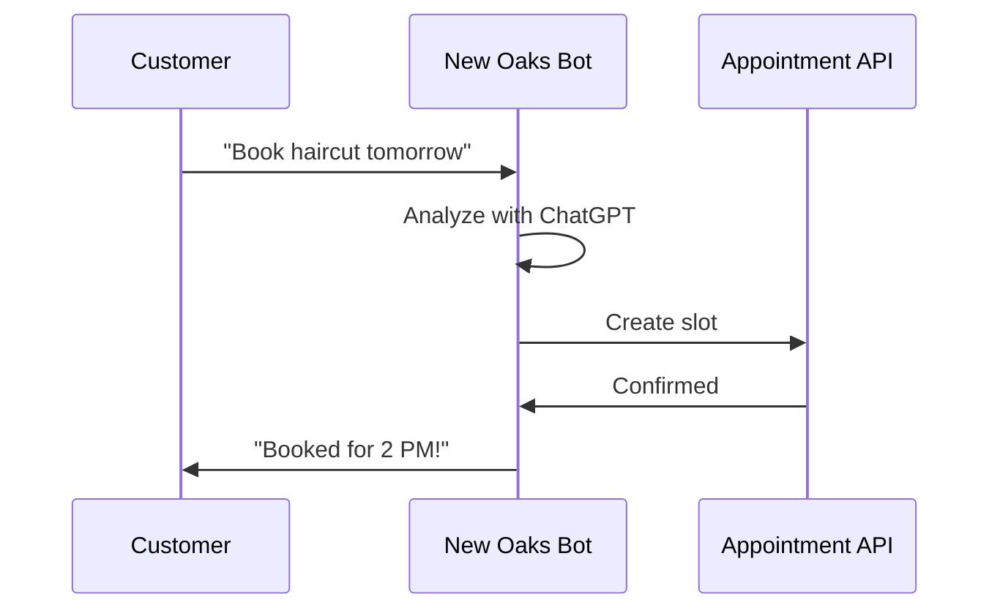

## Get Started in Minutes

Set up your New Oaks AI chatbot in under 10 minutes. This guide walks you through account creation, bot configuration, and testing your first SMS conversation. Once complete, your chatbot handles 24/7 customer queries, books appointments, and provides personalized responses powered by ChatGPT.

<Columns cols={3}>
  <Card title="Create Account" icon="user-plus" href="#create-account">
    Sign up and verify in seconds.
  </Card>
  <Card title="Configure Bot" icon="settings" href="#setup-bot">
    Customize prompts and webhooks.
  </Card>
  <Card title="Test Conversation" icon="message-circle" href="#test-conversation">
    Simulate real SMS interactions.
  </Card>
</Columns>

## Create Your Account

Begin by signing up for a free New Oaks AI account.

<Steps>
  <Step title="Visit Dashboard" icon="globe">
    Navigate to the [New Oaks AI dashboard](https://dashboard.newoaks.ai) and click **Sign Up**.
  </Step>
  <Step title="Enter Details" icon="edit-3">
    Provide your business email, name, and phone number. Accept the terms and click **Create Account**.
  </Step>
  <Step title="Verify Email" icon="mail">
    Check your inbox for a verification link from `no-reply@newoaks.ai`. Click it to activate your account.
  </Step>
</Steps>

<Callout kind="tip">
  Use a business email for full SMS capabilities. Personal emails limit you to testing mode.
</Callout>

## Initial Bot Setup

Configure your chatbot's behavior and connect it to your SMS provider.

### Access Bot Builder

Log in to your dashboard and select **New Bot**. Name it (e.g., "Appointment Booker") and choose your industry from the dropdown.

<Expandable title="Advanced Prompt Customization" default-open="false">
  Edit the default system prompt:

  ```
  You are a helpful assistant for [Business Name]. Book appointments via SMS. Ask for name, preferred time, and service. Confirm details before booking.
  ```

  Save changes to apply.
</Expandable>

### Set Up SMS Webhook

Connect your Twilio or similar SMS gateway.

<Tabs>
  <Tab title="Twilio" icon="phone">
    In Twilio Console, create a Messaging Service. Set the webhook URL to `https://api.newoaks.ai/v1/webhook/{YOUR_WEBHOOK_ID}` (replace `{YOUR_WEBHOOK_ID}` with your dashboard value).

    <CodeGroup tabs="cURL,Bash">
      ```bash
      curl -X POST https://api.newoaks.ai/v1/bots/YOUR_BOT_ID/webhooks \
        -H "Authorization: Bearer YOUR_API_KEY" \
        -d '{"provider": "twilio", "phoneNumber": "+15551234567"}'
      ```

      ```bash
      # Export your API key first
      export NEOAKS_API_KEY="your-api-key-here"
      curl -X POST https://api.newoaks.ai/v1/bots/YOUR_BOT_ID/webhooks \
        -H "Authorization: Bearer $NEOAKS_API_KEY" \
        -d '{"provider": "twilio", "phoneNumber": "+15551234567"}'
      ```
    </CodeGroup>
  </Tab>
  <Tab title="Other Providers" icon="plug">
    Paste your provider's inbound SMS URL into the dashboard webhook field. Test connectivity with the **Ping** button.
  </Tab>
</Tabs>

## Test Your First Conversation

Verify everything works with a simulated SMS exchange.

### Use the Simulator

In your dashboard, open **Test Bot**. Send a sample message:

```
Hi, I'd like to book a haircut for tomorrow.
```

Your bot responds:

```
Great! What's your name and preferred time (e.g., 2 PM)?
```

Continue the conversation to book an appointment.

### Live SMS Test

Text your Twilio number: "Book appointment". Monitor responses in real-time.

<Callout kind="success">
  Success! Your chatbot now converts queries to bookings 24/7. Check the **Analytics** tab for conversation logs.
</Callout>

## Next Steps

<Columns cols={2}>
  <Card title="Customize Responses" icon="edit" href="/docs/customization">
    Tailor prompts for your services.
  </Card>
  <Card title="Integrate Calendar" icon="calendar" href="/docs/integrations">
    Sync with Google Calendar or similar.
  </Card>
</Columns>

